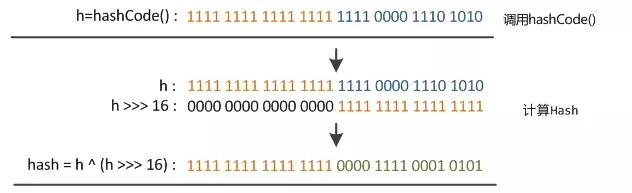

# 前言
总结了一个月的面试经验(其实也就3场面试...)，HashMap这个点基本上是必被问到的，因此想再看一遍HashMap的源码，对其底层加深一下印象。

# 什么是HashMap？
HashMap本质当然是Map，是一个存储Key-Value键值对的数据结构。由于它会对每个Key进行Hash操作存储定位，因此它的查询以及插入效率非常高。在理想状态下时间复杂度为O(1)，最差情况下时间复杂度为O(n)。但同时它也是线程不安全的，如果想要使用线程安全的HashMap建议使用ConcurrentHashMap。

# HashMap的内部结构
HashMap的本质是一个链表+数组的数据结构。（JDK1.8还增加了红黑树的结构） 其源码如下：

```java
    //主要存储数据的对象 table
    transient Node<K,V>[] table;

    //Node类
    static class Node<K,V> implements Map.Entry<K,V> {
    //算出的hash值，用来定义数组索引的位置
    final int hash;
    //key值
    final K key;
    //value值
    V value;
    //指向下一个Node对象
    Node<K,V> next;

    //get set方法
    ...
  }    
```
从源码我们可以看到Node类作为HashMap的静态内部类，本身实现了Map.Entry,它是真正用来存储键值对的，同时他也是一个链表。而HashMap内部维护了一个Node数组名为table的变量，也被称为哈希桶数组，是HashMap的核心，各项操作都围绕它展开。

HashMap还有几个比较重要的成员变量，在了解其原理之前我们必须先认识他们。

```java

//HashMap目前保存键值对数量(也就是大小)
transient int size;

//记录HashMap内部结构发生变化的次数
transient int modCount;

//所能容纳的键值对极限
int threshold;

//负载因子
final float loadFactor;
```

**size**
和其他容器的size一样，代表着目前HashMap存放的键值对数量

**threshold**
代表HashMap能容纳键值对的个数极限，如果一旦超过这个极限HashMap就会进行相应的扩容。

**loadFactor**
是负载因子，它也会影响到threhold的变化：threshold = length * loadFactor 。这里的
**length**
也就是table数组的大小 ，默认值给的是16，值得注意的是它的值永远是2的n次方，这是HashMap做的一个优化点，也是面试经常问的，后续会讲明其原因。从上面这个公式可以看出，loadFactor越小，threshold也会越小，会导致扩容频率变高，容易造成空间浪费。loadFactor越大，threshold也会越大，扩容频率变小，但会增大Hash冲突的机率，耗时更久(这一块目前不理解没关系，后面会讲解)。因此loadFactor的大小填写，是需要我们再时间复杂度与空间复杂度之间权衡的，系统默认值给的是0.75，符合大部分情况，一般不建议修改。

**modCount**
字段主要用来记录HashMap内部结构发生变化的次数，主要用于迭代的快速失败。强调一点，内部结构发生变化指的是结构发生变化，例如put新键值对时modCount会加一，但是某个key对应的value值被覆盖不属于结构变化所以modCount不会变化。

# HashMap 源码解析
对HashMap有一定的了解后，我们终于可以开始手撕源码啦。我们首先就从put方法进入开始看源码

```java
public V put(K key, V value) {
        return putVal(hash(key), key, value, false, true);
}

/**
 * Implements Map.put and related methods
 *
 * @param hash key的hash值
 * @param key  key值
 * @param value value值
 * @param onlyIfAbsent 如果key对应的value已经存在，是否覆盖value值
 * @param evict 如果为false表示处于创建状态
 * @return 返回key对应的上一个value数据，如果没有就返回null
 */
final V putVal(int hash, K key, V value, boolean onlyIfAbsent, boolean evict) {
                 ...
}
```
我们可以看到put方法本身内部又调用了putVal，它有五个入参，在注解上我也已经写了，
它们分别代表：
 1. hash：key的hash值
 2. key： key值
 3. value: value值
 4. onlyIfAbsent：如果key对应的value已经存在，是否覆盖value值
 5. evict：如果为false表示处于创建状态，仅仅为LinkedHashMap方便排序操作，HashMap中可以忽略

针对于onlyIfAbsent为true，很明显我们的HashMap如果key已经对应存在对应value映射，在put时会覆盖掉原来的值，想不覆盖的话可以调用putIfAbsent()方法。

有一个重点其实是在方法hash(key)上，这个方法计算出了key的hash值，他是HashMap的精华所在，也是面试中常问的一个考点。接下来我们将重点说明下这个方法以及如何使用这个hash值
## hash()方法以及确定哈希桶数组索引位置
hash()方法其实顾名思义就是用来获取key的hash的一个hash值的,但是HashMap里的hash()方法似乎与一般的直接key.hashCode()不太一样，我们先看看它到底是什么样的神奇操作。
其源码如下:
```java
static final int hash(Object key) {
    int h;
    return (key == null) ? 0 : (h = key.hashCode()) ^ (h >>> 16);
}
```
歪果仁的代码追求精简，虽然就两行，但是看起来还是蛮恶心的，但是还是可以看出来如果key为空，那么hash值就默认问0，这也就说明HashMap的key是可以为空的，而我们也知道HashTable的key不能为空。如果不为空则会执行后面一长串，这一长串可以分步骤看
1. h = key.hashCode() 获取了key的hashCode值
2. h^h>>>16   将hashCode的值异或他的高16位获取到hash值

我们知道hashCode本身是一个32位的int类型，进行这样的操作就等于将hashCode的高16位异或它的低16位得到一个新的hash值。

但是拿到这样一个hash值的作用是什么呢？我们可以先想一下如何利用key的hash值确定每个key的哈希桶索引位置而且还需要尽量均衡。第一个想到的当然是用hash值对哈希桶的长度(length)进行取模的操作。(当然我本人是连这种方式都想不到的= =)即:

 **index = hash % length**


这种方式可以用随机的hash值算出随机的索引并且也分配尽量均匀。没错！!HashMap也是这么想的。但是这种取模运算本身是对CPU运算开销比较大的，为了优化速度，HashMap采取了更优雅的方式，在putVal的核心代码里可以看到这么一段：

```java
/**
*为了方便理解,代码有改动+精简,但是整体思路没变
*/
final V putVal(int hash, K key, V value, boolean onlyIfAbsent, boolean evict) {            
                    //table就是HashMap的table即哈希桶
                    Node<K,V>[] tab = table;    
                    //哈希桶的长度
                    int length = tab.length;  
                    //确定索引的位置
                    int index = (length-1) & hash;       
                    //索引的值
                    Node<K,V> p = tab[index];
               }
```

我们可以看到HashMap采用了hash值"与"length-1的方式来确定索引位置。即：

 **index = hash & length-1**

还记得之前我们说过hashTable的length总是2的n次方吗？这个是故意为了加快取模运算而设计的。当length的长度为2的n次方时hash值对length取模或者"与"上length-1得到的效果是一样的，但是"与"操作相比取模速度能快很多。
而之所以hash值要用拿hashcode的高16位异或低16位的原因根据官方的解释是从速度、功效、质量来考虑的，这么做可以在数组table的length比较小的时候，也能保证考虑到高低Bit都参与到Hash的计算中，同时不会有太大的开销。


<font color=red><b>小Tips:</b>

hash()方法中的高16位异或16位的计算方式，是在JDK1.8之后才加上的，在JDK1.7及之前的版本里是indexFor()方法，直接用hashCode&length-1计算出索引位置。如果面试官有问HashMap的JDK1.7与JDK1.8的区别可不要忘记说了哦
</font>

## putVal()方法解析
了解了如何确定哈希桶的索引地址后我们终于可以来看看核心操作方法putVal了，不多说直接撕源码
```java
/**
 * Implements Map.put and related methods
 *
 * @param hash key的hash值
 * @param key  key值
 * @param value value值
 * @param onlyIfAbsent 如果key对应的value已经存在，是否覆盖value值
 * @param evict 如果为false表示处于创建状态
 * @return 返回key对应的上一个value数据，如果没有就返回null
 */
final V putVal(int hash, K key, V value, boolean onlyIfAbsent, boolean evict) {
    Node<K,V>[] tab; Node<K,V> p; int n, i;

    //如果发现哈希桶为空或者长度为0，则进行扩容
    if ((tab = table) == null || (n = tab.length) == 0)
        n = (tab = resize()).length;

        //确定哈希桶的索引位置，如果里面目前没有数据，则直接插入新Node进去
    if ((p = tab[i = (n - 1) & hash]) == null)
        tab[i] = newNode(hash, key, value, null);

        //如果有数据，即发生hash冲突
    else {
        Node<K,V> e; K k;

        //如果新插入数据的key与发生冲突的Node的key值相同，则记录下来
        if (p.hash == hash &&
            ((k = p.key) == key || (key != null && key.equals(k))))
            e = p;

            //如果冲突的Node已经是红黑树结构了，则调用树的插入方法
        else if (p instanceof TreeNode)
            e = ((TreeNode<K,V>)p).putTreeVal(this, tab, hash, key, value);

            //如果是链表则开始遍历链表
        else {
            for (int binCount = 0; ; ++binCount) {
                //整个链表遍历完成后仍未发现key值相同的数据,则在链表结尾插入数据
                if ((e = p.next) == null) {
                    p.next = newNode(hash, key, value, null);
                    //插入数据后，发现链表数量已经到达一定长度后链表转换为红黑树
                    if (binCount >= TREEIFY_THRESHOLD - 1) // -1 for 1st
                        treeifyBin(tab, hash);
                    break;
                }
                //发现新插入的key值与链表已存在的数据key值相同，则记录下来
                if (e.hash == hash &&
                    ((k = e.key) == key || (key != null && key.equals(k))))
                    break;
                p = e;
            }
        }
        //如果有替换原有数据，则将新值替换旧值并返回旧值
        if (e != null) { // existing mapping for key
            V oldValue = e.value;
            //如果onlyIfAbsent为true就不替换了
            if (!onlyIfAbsent || oldValue == null)
                e.value = value;
            //方便linkedHashMap排序操作，HashMap里可无视
            afterNodeAccess(e);
            return oldValue;
        }
    }
    //modCount+1
    ++modCount;
    //如果新加如元素后发现键值对超过所能容纳的键值对极限则进行扩容
    if (++size > threshold)
        resize();        
      //方便linkedHashMap排序操作，HashMap里可无视    
    afterNodeInsertion(evict);
    return null;
}

```
根据代码我们可以大致理出putVal的操作流程
1. 判断哈希桶大小，如果为空则进行第一次的扩容
2. 计算索引位置index，如果哈希桶索引位置table[index]没有数据则插入数据新数据，并判断键值对数量是否超过了threshHold，超过了则进行扩容。
3. 如果table[index]有数据即发生hash冲突，table[index]的key值是否与插入的数据相同，则使用新的数据覆盖原有数据并返回原有数据，否则继续。
4. 判断table[index]是否为为红黑树，如果是的话则直接在红黑树中插入数据，否则则继续
5. 遍历联表tabe[i],如果存在key相等的数据则覆盖原有数据，并返回原有数据。如果不存在key相等的数据则在链表末尾插入新数据，同时判断链表长度是否到达可以转换红黑树的标准(默认长度为8)，到达的话则进行转换。

具体流程如图如下所示：


<font color=red><b>小Tips:</b>

链表长度大于8转换成红黑树的操作是在JDK1.8中新加的，目的是当出现大量Hash冲突时也能使用红黑树让查找的时间复杂度由O(n)降低为O(logn)。至于红黑树里面添加数据的源码我就不手撕了，确实比较复杂，我撕不动...知道红黑树是一颗特殊的二叉平衡查找树即可。
</font>
